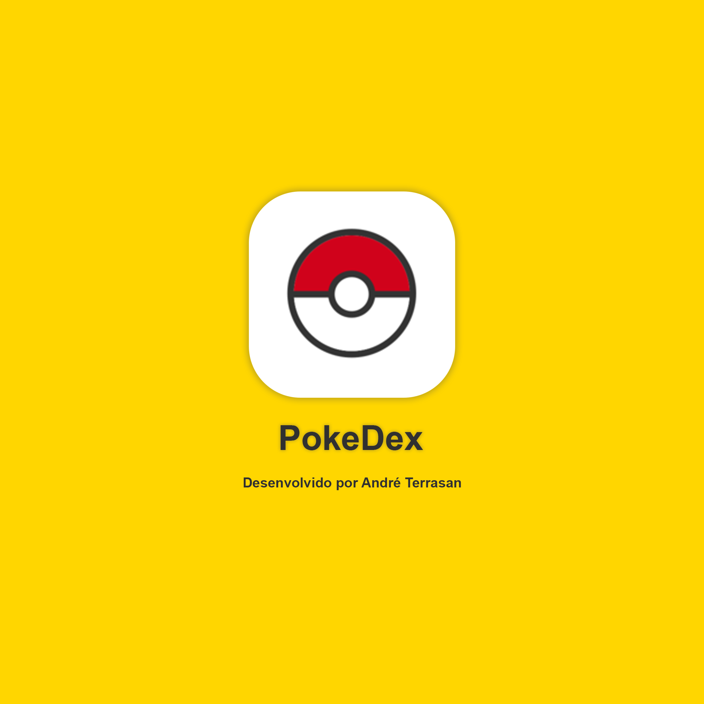

<p align="center">
   
</p>

# Pokedex


[](https://github.com/Andrevft)
[](#)
[](https://github.com/Andrevft/pokedex/stargazers)
[](https://github.com/Andrevft/pokedex/network/members)
[](https://github.com/Andrevft/pokedex/graphs/contributors)


> Pokémon Pokedex powered by PokéAPI is my projects made in React Native.

<br />
<p align="center"></p>
<p align="center"></p>
<p align="center"></p>

---

# :pushpin: Table of Contents

* [Features](#rocket-features)
* [Installation](#construction_worker-installation)
* [Getting Started](#runner-getting-started)
* [FAQ](#postbox-faq)
* [Found a bug? Missing a specific feature?](#bug-issues)
* [Contributing](#tada-contributing)
* [License](#closed_book-license)


# :rocket: Features

* 👩🏽‍🍳 Explore recipes and find amazing chefs.
*  🍕 Create an account to manage recipes, chefs and users.
* 📨  As an administrator of the platform, you're able to invite other users.
* 🌏  Multi language support - English and Portuguese.
* 🎨  A cool dark mode theme toggle.

**Obs: The admin platform isn't all translated yet.**

# :construction_worker: Installation

**You need to install [Node.js](https://nodejs.org/en/download/) and [Yarn](https://yarnpkg.com/) first, then in order to clone the project via HTTPS, run this command:**

```git clone https://github.com/Andrevft/pokedex.git```

SSH URLs provide access to a Git repository via SSH, a secure protocol. If you have a SSH key registered in your Github account, clone the project using this command:

```git clone git@github.com:Andrevft/pokedex.git```

**Install dependencies**

```yarn install```

Create your enviroment variables based on the examples of ```.env.example```

```cp .env.example .env```

After copying the examples, make sure to fill the variables with new values.

# :runner: Getting Started

**Running with docker-compose**

In order to prepare the database and also run the application, set your environment variables and then execute docker-compose

```docker-compose up```

With this command, the port seted in your environment `PORT` variable will be available to access the application.

**Manually setup**

You may prefer to manually configure the database and the application.

Install [Postgres](https://www.postgresql.org/) to create a database or if you have [Docker](https://www.docker.com/) in your machine, fill the environment values related to database configurations and the run the following commands in order to create a postgres container.

```docker-compose up postgres```

Execute the follow command to create tables, relationships and procedures:

```yarn db:create```

To start, run the seeds provided in [Seeds](https://github.com/Andrevft/pokedex/blob/master/src/database/seeds.js) in order to populate the database with an initial data.

```yarn run:seeds```

Run the following command in order to start the application in a development environment:

```yarn dev```

# :postbox: Faq

**Question:** What are the tecnologies used in this project?

**Answer:** The tecnologies used in this project are [NodeJS](https://nodejs.org/en/) + [Express Framework](http://expressjs.com/en/) to handle the server, [Nunjucks](https://mozilla.github.io/nunjucks/templating.html) to develop amazing views & [SCSS](https://sass-lang.com/documentation/syntax) to handle the styles architecture and a better maintenance than normal CSS.
##
**Question:** How the multi language support is handled by the server?

**Answer:** This application handle multi language support with the help of a library called [i18n-node](https://github.com/mashpie/i18n-node). It has a middleware that gather language settings of visitors and then persist translations from [JSON files](https://github.com/Andrevft/pokedex/tree/master/src/locales) related with a specific locale.

The locale is storaged as a cookie named ```pokedex:locale``` and that can be changed by passing a query string with the value ```?lang=pt```
##

**Question:** Are all kind of users able to create and update chefs or recipes?

**Answer:** The application has two kind of users: Visitors and Administrators. As a administrator, you're able to create, update and view all the data related to recipes, chefs and also other users. Visitors can also access the admin platform but they don't have access to the views responsable to create and update data.


# :bug: Issues

Feel free to **file a new issue** with a respective title and description on the the [pokedex](https://github.com/Andrevft/pokedex/issues) repository. If you already found a solution to your problem, **i would love to review your pull request**! Have a look at our [contribution guidelines](https://github.com/Andrevft/pokedex/blob/master/CONTRIBUTING.md) to find out about the coding standards.

# :tada: Contributing

Check out the [contributing](https://github.com/Andrevft/pokedex/blob/master/CONTRIBUTING.md) page to see the best places to file issues, start discussions and begin contributing.

# :closed_book: License

Released in 2020.
This project is under the [MIT license](https://github.com/Andrevft/pokedex/blob/master/LICENSE).

Made with love by [André Terrasan](https://github.com/Andrevft) 💜🚀


npm install -g expo-cli
npm install

npm install axios


npm install @react-navigation/native
expo install react-native-gesture-handler react-native-reanimated react-native-screens react-native-safe-area-context @react-native-community/masked-view
npm install @react-navigation/stack


expo install expo-constants
expo install @expo-google-fonts/robotonpm straa expo-font